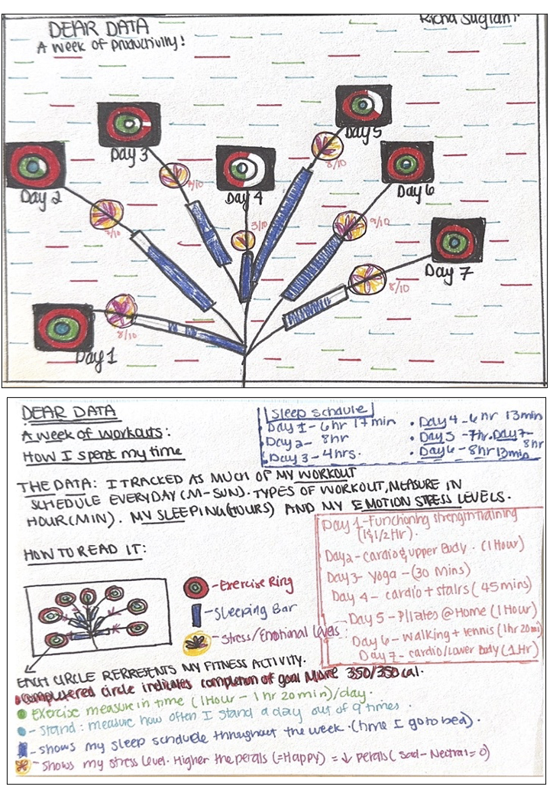

# Dear Data Postcard

Here is my Dear Data postcard:

## Explanation and Reflection

(For this Dear Data postcard, I focused on creating a visual representation of key aspects of my weekly wellness routine. The postcard tracks three main variables: exercise, emotional state, and sleep schedule.

**Exercise:** The concentric circles resembling fitness rings represent different aspects of physical activity, including movement, exercise, and standing. These circles visualize the intensity and duration of my workouts throughout the week.

**Emotional State:** The color gradient from cool blues to warm yellows indicates fluctuations in my emotional state over the week. Brighter colors signify more positive feelings, while darker shades represent lower moods.

**Sleep Schedule:** Horizontal bars depict the duration and quality of my sleep each night. Longer bars suggest more restful sleep, while shorter ones indicate periods of sleep deprivation or disruption.

Through this visual representation, I gained insights into how my emotional state fluctuates in correlation with exercise and sleep patterns. Notably, I observed a positive impact of intense workouts, particularly heavy lifting sessions, on my energy levels and sleep quality. However, maintaining a consistent sleep schedule proved challenging due to the demands of work and school.

Overall, this project was a valuable exercise in self-reflection and creative exploration of personal data. It heightened my awareness of daily habits and their influence on my well-being, prompting me to consider potential improvements for a more balanced lifestyle.)

